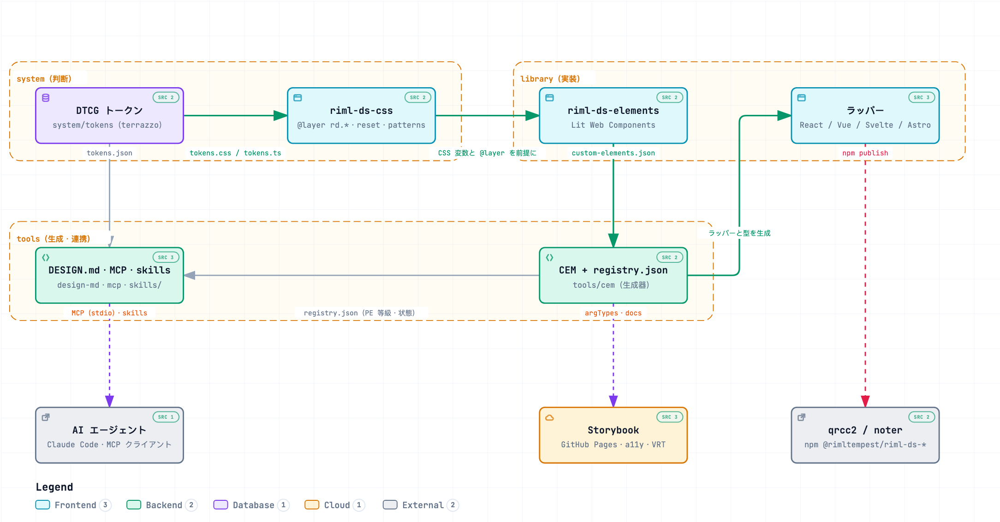

# riml-ds

riml のプロダクト群（qrcc・noter …）が共有するデザインシステムとコンポーネントライブラリ。

| 領域       | パッケージ                                                     | 中身                                           |
| ---------- | -------------------------------------------------------------- | ---------------------------------------------- |
| システム   | `@rimltempest/riml-ds-tokens`, `@rimltempest/riml-ds-css`                              | DTCG トークン、基礎 CSS、ガイドライン、DESIGN.md |
| ライブラリ | `@rimltempest/riml-ds-elements`, `@rimltempest/riml-ds-react`, `@rimltempest/riml-ds-vue`, `@rimltempest/riml-ds-svelte`, `@rimltempest/riml-ds-astro` | Lit Web Components と生成ラッパー |
| ツール     | `@rimltempest/riml-ds-lint`, `@rimltempest/riml-ds-mcp`                                | 利用側で使う lint 設定と MCP サーバ            |

## 構成

<picture>
  <source media="(prefers-color-scheme: dark)" srcset="docs/architecture/riml-ds-architecture.dark.png">
  
</picture>

- `system/*` は `library/*` を知らない。判断はトークンと `DESIGN.md` に、実装は `elements` に置く
- ラッパーは `custom-elements.json` **だけ**を入力にする。`DESIGN.md`・MCP・`registry.json` も同じ生成物から作る
- 図は [archify](https://github.com/tt-a1i/archify) で
  [`docs/architecture/riml-ds.architecture.json`](docs/architecture/riml-ds.architecture.json) から生成している。
  対話版は [`docs/architecture/riml-ds-architecture.html`](docs/architecture/riml-ds-architecture.html)（clone してブラウザで開く）。
  構成を変えたら仕様 JSON を直して `bun run archify` で作り直す

## 入口

- 使い方: `skills/riml-ds/SKILL.md`（エージェント向け）/ Storybook（GitHub Pages）
- 設計: `docs/architecture.md`、`docs/adr/`、`DESIGN.md`
- 開発: `CLAUDE.md`

## リリース

changesets で版と CHANGELOG を管理する。公開パッケージは **fixed**（全部同じ版で上がる）。
`0.x` の間は minor に破壊的変更が入り得る（ADR-0009）。

1. 変更する PR に `bun run changeset` で `.changeset/*.md` を足す
2. main へのマージで `release.yml` が Version PR を作る
3. Version PR のマージで npm へ publish（Trusted Publishing、トークン無し）

詳細は `docs/publishing.md`。

## ライセンス

MIT
